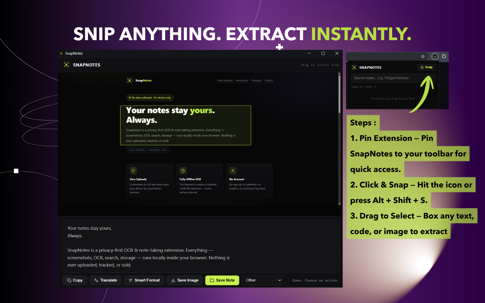

# SnapNotes — Screenshot OCR & Study Notes

> Privacy-first Chrome extension that turns any tab into a searchable note.

  

SnapNotes lets you capture text from anywhere on screen — lecture slides,
PDFs, e-books, videos, websites — with a simple drag-select. Text is
extracted **on-device** (no cloud, no uploads), then copied, translated,
or organized into a searchable, subject-tagged note library.



## Features

- **Drag-select OCR** — press `Alt+Shift+S`, drag over any area, text extracted instantly
- **Live drag mode** — OCR directly on the page (Copyfish-style)
- **PDF fallback mode** — auto-detects pages that can't be injected into (PDF viewer, `chrome://`) and switches to panel capture
- **Works on anything** — PDFs, videos, e-books, code, images
- **Translate** — one click to Google Translate
- **Smart Format** — clean up messy OCR into `Label : Value` structure
- **Auto subject tagging** — Math, Programming, Networking, Security, OS, Business
- **Custom subjects** — add your own
- **Searchable library** — full-text search across all saved notes
- **Save & organize** — PNGs saved to `Downloads/SnapNotes/<subject>/` with clean names (`subject_date.png`)

## Privacy by design

| | |
|---|---|
| OCR engine | Tesseract.js — bundled, runs 100% offline |
| Storage | Local only (IndexedDB + Downloads folder) |
| Data collection | **None** — no analytics, no telemetry, no tracking |
| Account | Not required |
| Remote code | None — everything ships in the package |

## Install (development)

1. Clone this repo
2. Open `chrome://extensions`
3. Enable **Developer mode**
4. Click **Load unpacked** → select the `snapnotes` folder
5. Press `Alt+Shift+S` (or click the icon → Snap)

> ⚠️ `lib/` contains the bundled Tesseract OCR engine (~18MB) so the
> extension works fully offline after load.

## Usage

1. Open any page (slides, PDF, video, website)
2. Press `Alt+Shift+S`
3. Drag to select the area you want
4. OCR runs automatically — then:
   - **Copy** — text to clipboard
   - **Translate** — open in Google Translate
   - **Smart Format** — tidy `Label : Value`
   - **Save Image** — PNG to Downloads
   - **Save Note** — PNG + indexed for search
5. Click the SnapNotes icon to search your library

## Tech stack

- Chrome Extension **Manifest V3**
- **Tesseract.js** (wasm core bundled locally — no CDN at runtime)
- **IndexedDB** — local note search index
- Vanilla JavaScript — no frameworks

## Project structure

```
snapnotes/
├── manifest.json      # MV3 manifest (zero host permissions — activeTab only)
├── background.js      # capture orchestration, live-drag + panel modes
├── live-drag.js       # Mode A: drag-select overlay on the page
├── panel.html/js      # Mode B: capture-then-drag panel with OCR actions
├── popup.html/js      # searchable note library
├── lib/               # bundled Tesseract.js (worker, wasm core, trained data)
└── icons/             # extension icons
```

## Privacy policy

Full policy: [nabvbl.github.io/snapnotes-privacy](https://nabvbl.github.io/snapnotes-privacy/)

## License

MIT — feel free to learn from, fork, and build on this.
